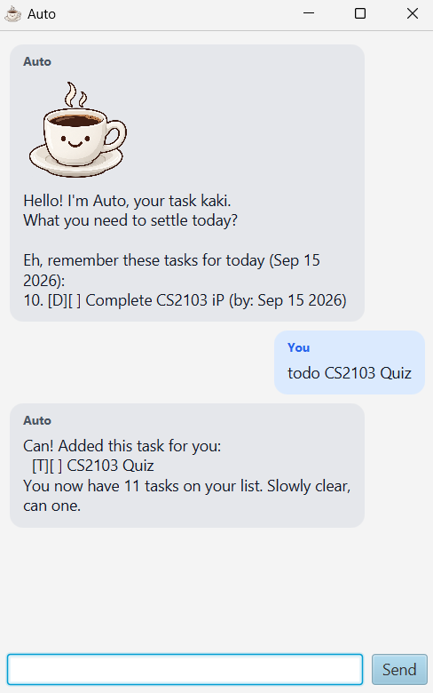
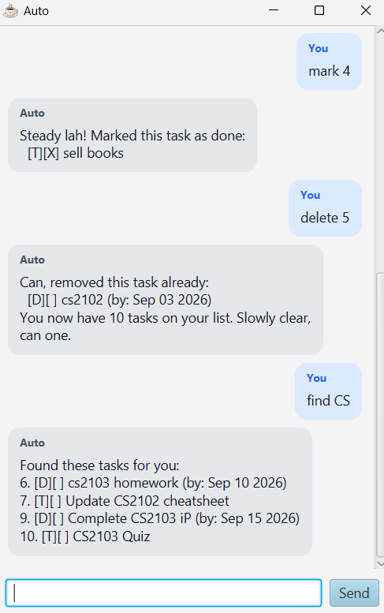

# Auto User Guide

// Update the title above to match the actual product name

// Product screenshot goes here

// Product intro goes here


> Auto is your task kaki. A task chatbot with a Singaporean personality!





## Features

| No. | Feature                        | Description                                                                                           |
| --- | ------------------------------ | ----------------------------------------------------------------------------------------------------- |
| 1   | Adding todo                    |                                                                                                       |
| 2   | Adding deadline                | Adding a task with a `by` date                                                                        |
| 3   | Adding event                   | Adding a task with a `from` and `to` date                                                             |
| 4   | Occur on date                  | Search for deadlines that occur on a specific date or events that occur between the date              |
| 5   | Search task                    | Search task based on name                                                                             |
| 6   | Mark/unmark task               | Mark and unmark task as done                                                                          |
| 7   | Delete task                    | Remove the task from the list                                                                         |
| 8   | Task reminders (BCD-Extension) | Similar to `Occur on date`, but reminder is displayed on application start and using the current date |

## Adding todo

// Describe the action and its outcome.

// Give examples of usage

Example: `keyword (optional arguments)`

// A description of the expected outcome goes here

```
expected output
```

## Adding deadlines

// Describe the action and its outcome.

// Give examples of usage

Example: `keyword (optional arguments)`

// A description of the expected outcome goes here

```
expected output
```

## Adding event

// Describe the action and its outcome.

// Give examples of usage

Example: `keyword (optional arguments)`

// A description of the expected outcome goes here

```
expected output
```

## Occur on date

// Describe the action and its outcome.

// Give examples of usage

Example: `keyword (optional arguments)`

// A description of the expected outcome goes here

```
expected output
```

## Search task

// Describe the action and its outcome.

// Give examples of usage

Example: `keyword (optional arguments)`

// A description of the expected outcome goes here

```
expected output
```

## Mark/unmark tasks

// Describe the action and its outcome.

// Give examples of usage

Example: `keyword (optional arguments)`

// A description of the expected outcome goes here

```
expected output
```

## Delete tasks

// Describe the action and its outcome.

// Give examples of usage

Example: `keyword (optional arguments)`

// A description of the expected outcome goes here

```
expected output
```
