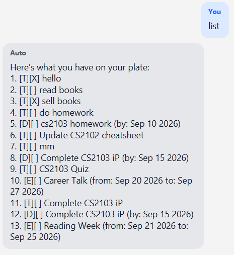
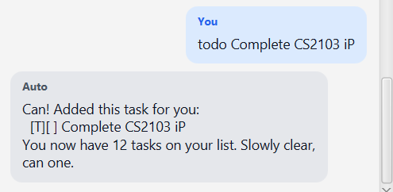
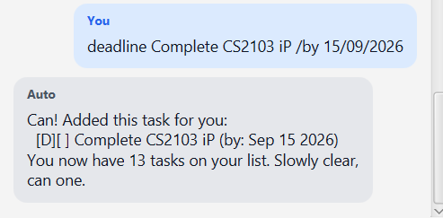
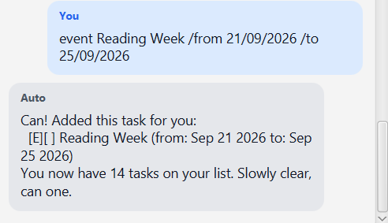
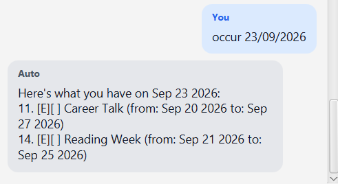
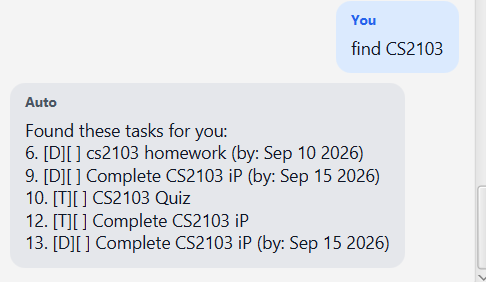
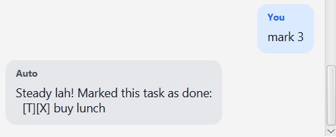
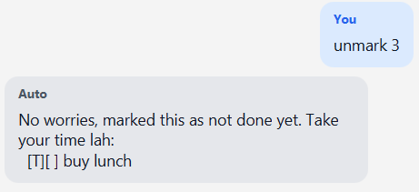
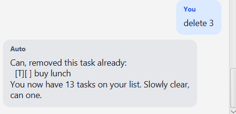

# Auto User Guide

  
  

> Auto is your task kaki. A task chatbot with a Singaporean personality!

## Features

| No. | Feature                        | Description                                                                                           |
| --- | ------------------------------ | ----------------------------------------------------------------------------------------------------- |
| 1   | List tasks                     |                                                                                                       |
| 2   | Adding todo                    |                                                                                                       |
| 3   | Adding deadline                | Adding a task with a `by` date                                                                        |
| 4   | Adding event                   | Adding a task with a `from` and `to` date                                                             |
| 5   | Occur on date                  | Search for deadlines that occur on a specific date or events that occur between the date              |
| 6   | Find task                      | Search task based on name                                                                             |
| 7   | Mark/unmark task               | Mark and unmark task as done                                                                          |
| 8   | Delete task                    | Remove the task from the list                                                                         |
| 9   | Task reminders (BCD-Extension) | Similar to `Occur on date`, but reminder is displayed on application start and using the current date |

## List tasks

List all tasks managed by the application.

Example: `list`

## Adding todo

Adds a todo task to the application and saves it to the save file.

Example: `todo Complete CS2103 iP`

## Adding deadlines

Adds a deadline task to the application and saves it to the save file. Deadline task require a `/by dd/MM/yyyy` argument to be provided.

Example: `deadline Complete CS2103 iP /by 15/09/2026`

## Adding event

Adds a event task to the application and saves it to the save file. Event task require a `/from dd/MM/yyyy /to dd/MM/yyyy` argument to be provided.

Example: `event Reading Week /from 21/09/2026 /to 25/09/2026`

## Occur on date

The occur command searches the task list for:

1. Deadlines that occur on the specified date.
2. Events that span the specified date.

Requires the date format provided to be `dd/MM/yyyy`.

Example: `occur 23/09/2026`

## Find task

The find command searches the task list based on the task name.

Example: `find CS2103`

## Mark/unmark tasks

Mark and unmark a task as complete or uncomplete. The task's index needs to be specified

Example: `mark 3`
Example: `unmark 3`

## Delete tasks

Delete a task from the application and the save file. The task's index needs to be specified

Example: `delete 3`

